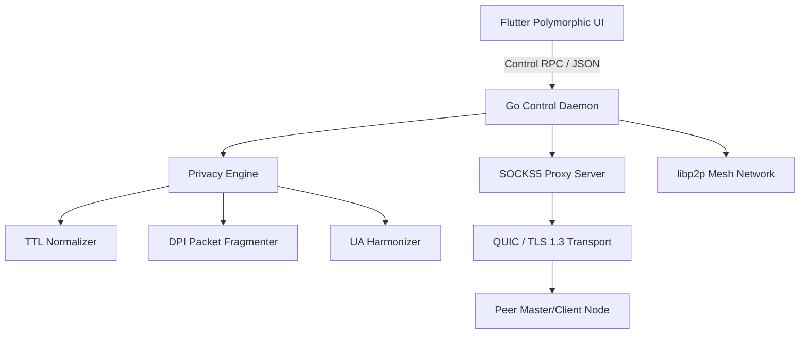

# AirBridge 5G — Cross-Platform Network Resilience & Connectivity Utility

AirBridge 5G is an enterprise-grade peer-to-peer network utility and internet sharing system. It enables secure, encrypted tethering over local mesh networks while obscuring network signatures via a privacy engine (TTL normalization, packet fragmentation, User-Agent harmonization).

---

## Key Features

- **Polymorphic UI System**: Single Flutter codebase dynamically morphing visual theme, layout, and component structure based on device role (**Master** vs **Client**) and operating system (**Android**, **iOS**, **Windows**).
- **Master / Provider Mode**:
  - Encrypted SOCKS5 / QUIC relay server.
  - QR Code credential generator for effortless peer onboarding.
  - Real-time throughput graph (FL Chart with 500ms sampling).
  - Connected device roster with bandwidth and latency tracking.
- **Client / Receiver Mode**:
  - One-click QR scanner and auto-configuration.
  - Automatic system proxy routing.
  - Minimalist Sky Blue theme.
- **Privacy Preservation Engine**:
  - **TTL Normalization**: Rewrites IPv4/IPv6 packet headers to standard mobile values (`TTL=64`) to obscure desktop OS signatures.
  - **DPI Resilience**: Smart TLS record and TCP packet fragmentation (Fixed, Random, TLS-split).
  - **User-Agent Harmonization**: Strips desktop signatures from HTTP headers.
- **Cross-Platform Daemon**: Go control plane daemon with libp2p mesh network, SQLite state management, and platform-specific proxy configurations (Windows Firewall/netsh, Linux iptables/gsettings, macOS pfctl/networksetup).

---

## Project Structure

```
├── core/
│   ├── go/                             # Go Data & Control Plane Daemon
│   │   ├── cmd/securemesh-node/        # Daemon entry point
│   │   ├── internal/
│   │   │   ├── mesh/                   # libp2p P2P mesh network
│   │   │   ├── platform/               # OS bindings (Windows, Linux, Darwin)
│   │   │   ├── privacy/                # Privacy engine (TTL, fragmenter, UA)
│   │   │   ├── proxy/                  # RFC 1928 SOCKS5 proxy server
│   │   │   ├── services/               # Daemon control plane
│   │   │   ├── storage/                # SQLite state store
│   │   │   └── transport/              # QUIC & SOCKS5-over-TLS transports
│   └── rust/                           # High-performance packet hotpath (FFI)
├── apps/
│   └── airbridge_5g/                   # Flutter Polymorphic UI
│       ├── lib/
│       │   ├── app.dart                # Role-adaptive Material / Cupertino app shell
│       │   ├── features/
│       │   │   ├── home/               # Role selection screen
│       │   │   ├── master/             # Dark Navy + 5G Green dashboard
│       │   │   ├── client/             # Sky Blue QR scanner & connect screen
│       │   │   └── settings/           # Privacy & Network settings
│       │   ├── providers/              # Riverpod state management
│       │   ├── routing/                # GoRouter with smooth transitions
│       │   └── utils/                  # QR & crypto utilities
│       └── test/                       # Unit & widget tests
└── proto/                              # Protobuf control plane schemas
```

---

## Getting Started

### 1. Running the Go Daemon

```bash
cd core/go
go run ./cmd/securemesh-node
```

### 2. Running the Flutter UI

```bash
cd apps/airbridge_5g
flutter pub get
flutter run
```

### 3. Running Unit Tests

**Go Backend Tests**:
```bash
cd core/go
go test -v ./...
```

**Flutter App Tests**:
```bash
cd apps/airbridge_5g
flutter test
```

---

## Architecture Overview



---

## License

AirBridge 5G is dual-licensed under MIT and Apache 2.0.
