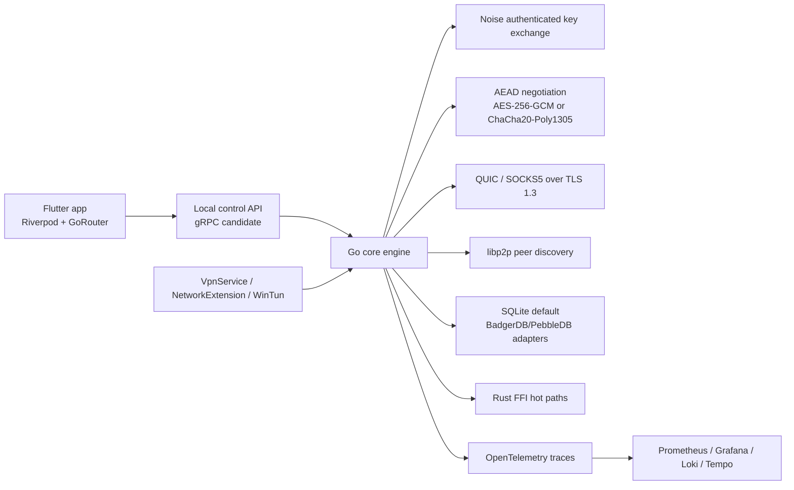

# Architecture

SecureMesh is split into a Go control/data engine, optional Rust hot paths, platform VPN adapters, and a Flutter operations UI.

## Core boundaries

- `protocol` owns capability negotiation and session profiles.
- `handshake` owns Noise pattern and cipher-suite selection.
- `securecrypto` owns AEAD construction and packet encryption helpers.
- `transport` owns QUIC and SOCKS5-over-TLS adapter interfaces.
- `mesh` owns the libp2p adapter boundary.
- `storage` owns persistent state, currently implemented with SQLite.
- `services` owns internal service contracts. gRPC should be introduced when the UI, daemon, and native platform shims are separated into independent processes.

## gRPC stance

The repository includes `proto/control/v1/control.proto` as the intended control-plane contract. Keep direct Go interfaces while the system is a single process. Generate gRPC clients and servers when at least two of these become separate deployables:

- Flutter desktop client.
- Local node daemon.
- Platform-specific VPN helper.
- Remote control-plane service.

## State stance

SQLite is the default because it is simple, transactional, and easy to inspect on devices. BadgerDB or PebbleDB should be added behind the same `storage.StateStore` interface if write volume or log-structured access patterns become the bottleneck.
